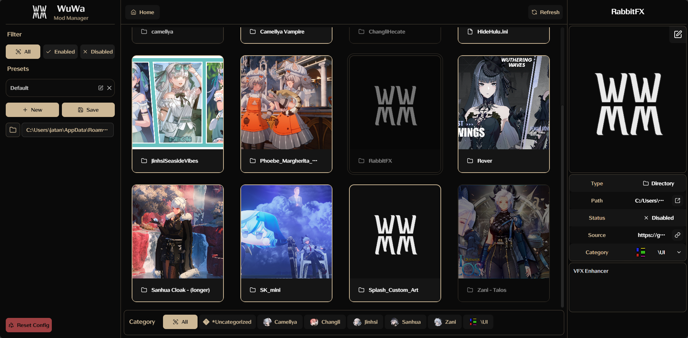

[]()  

### WuWa Mod Manager is a desktop application that streamlines mod management for Wuthering Waves. With one-click toggles, customizable presets, and built-in previews, it makes apply, organizing, and managing mods effortless.

## Features
 
- View available and installed mods in at a glance.  
- Toggle mods on or off with a single click.  
- Create, save, and switch between mod presets.  
- Assign preview images to individual mod folders.  
- Open any mod folder in your system’s file explorer or in the manager UI.  
- Rename mods inline without touching the file system.  
- Save and display source URLs for each mod.  
- Filter the mod list by character and by enabled/disabled status.

### Planned Features

- Launch Wuthering Waves via XXMI with your active mods pre-loaded.
- Add a built-in mod downloader to fetch mods directly from gamebanana and unzip it to the mod folder.  
- Detect hotkeys for mods and display them in the UI.
- Check if mods are up to date and notify the user.


## Installation

### Method 1: Using the Executable (Recommended)

- Download the latest release of WuWa Mod Manager from the GitHub repository.  

### Method 2: Run the Python Script 

1. Clone the repo:  
   ```bash
   git clone https://github.com/jpbhatt21/wuwa-mod-manager.git
   cd wuwa-mod-manager
   ```
2. Install dependencies:  
   ```bash
   pip install -r requirements.txt
   ``` 
3. Run the script:  
   ```bash
    python app.py
    ```

### Not making the frontend source code public yet, it is a mess and I am not ready to share it. But I will probably make documentation for the api routes in the future, so you can connect your own frontend.

## Usage

- **Run the app**: Run `WuWa-Mod-Manager.exe` or `app.py`.  
- **Select Mod Folder**: It will try to find the mod folder automatically by looking at `%APPDATA%\\XXMI Launcher\\WWMI\\Mods` , but if it doesn't, you can select it manually.
- **View Mods**: The app will display all available mods in the selected folder.
- **Toggle Mods**: `Left-click` to `Select`  |  `Right-click` to `Enable/Disable` a mod.
- **Edit Info**: `Edit mod info` such as source, name, preview etc in the `Right Panel`.
- **Create Presets**: Click the `Create Preset button` to `save your current mod configuration`. You can switch between presets easily.
- **Open Mod Folder**: `Double-click` on a mod to `open its folder` in the app itself, or `click on the folder button` in the info panel on the right to `open it in explorer` .

## Previews



## Contributing

Bug reports, feature requests, and pull requests are welcome.

## Credits

- [jpbhatt21](https://github.com/jpbhatt21)
- Inspiration from [XX Mod Manager for ZZZ - XLXZ](https://gamebanana.com/tools/18601)

## License

This project is not affiliated with Wuthering Waves or Kuro Games.  
MIT License


